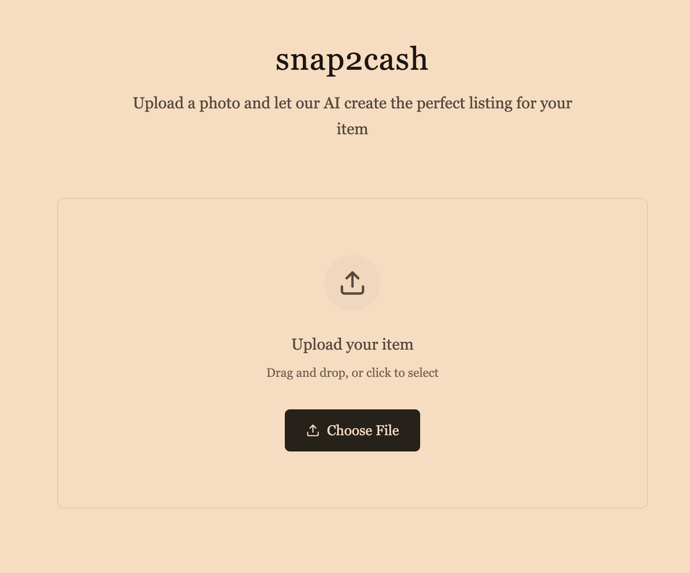

# 🛍️ snap2cash

snap2cash is a hackathon project that lets users quickly generate product listings using images and AI. Upload a photo and our Langflow-powered workflow handles the rest — extracting details and posting a listing to the marketplace automatically while getting the most relevant details about the item!

  

## 🧠 How It Works

1. User uploads a product photo and Langflow is used to quality check the image, identify the item in the photo, and produce a textual description.
2. This conext is passed to an ElevenLabs voice agent, who is instructed to ask some simple yet informative questions to the user, to help the next agentic flow.
3. The user's answers, along with the extracted image/item information, are passed into a hierarchical multi-agent system. Led by an Orchestrator Agent, with sub-agents such as a Research Agent with Tavily and AgentQL, a Pricing Agent, and a Listing Gen Agent, an informed listing is created.
4. After human-in-the-loop feedback, the listing is sent to whatever marketplace is integrated.

Note: In the future, the listing can be uploaded to many different marketplaces such as eBay (using its API interface)! The marketplace interface can be found [here](https://my-listing-app-tawny.vercel.app/)! 

## 🙌 Authors

- William Foster
- Lucas Chan
- Yile Huang

Built for Hacking Agents Hackathon – June 2025 – London. **It was fun!!!**
